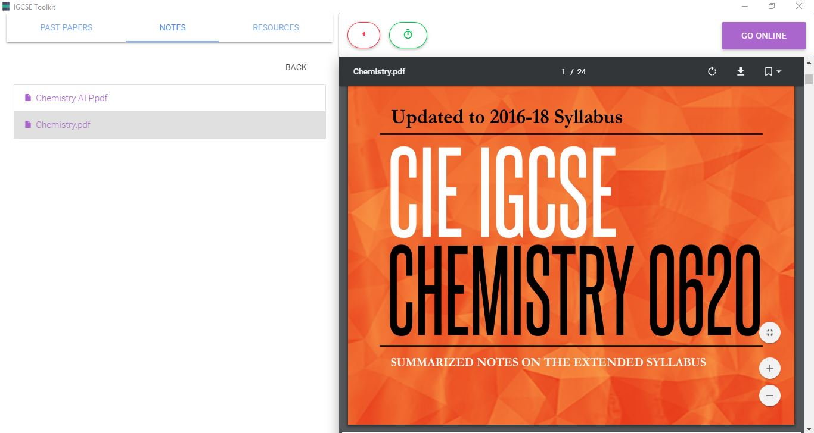

# IGCSE Toolkit

An app to help you get good grades

## How to import Past Papers (Offline)

Download The Past Papers from [Here](https://drive.google.com/drive/folders/0BzumkDfi9230dlpvM0hzUWJKbnc)

---------------------------

Extract the downloaded zip to __*installed path*/src/past-papers__

-------------------------------------

Open IGCSE Toolkit and *voila*

## Other Things

- Right Click files to open them in the native application.
- Notes and Resources come out of the box (However you can import or remove them).

- Visit my [Website](https://thecomputerm.github.io/).

